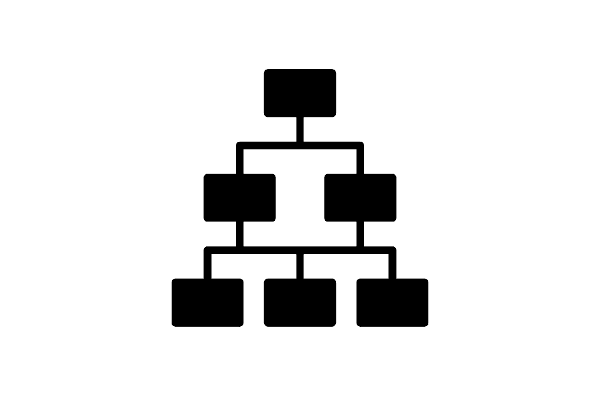

# Safigames

Projeto Final 2025 do Curso Técnico Integrado de Desenvolvimento de Sistemas - Colégio Pedro II - Campus Duque de Caxias

**Integrantes:**
 - João Miguel Judce Fragoso Senra
 - João Vitor Nascimento da Silva
 - Daniel do Nascimento Folly
 - Vitoria Ferreira de Almeida
 - Isaac de Magalhães Rocha da Silva

 ## Tecnologias

Este projeto é desenvolvido utilizando  para desenvolvimento da API de backend, SvelteKit como framework frontend e Tailwind como framework CSS.

Em termos de arquitetura de software, este projeto é composto por duas aplicações:
- API/Backend desenvolvida em Node.js com Express
- Aplicação Frontend desenvolvida com Svelte e estilizada com Tailwind

A Aplicação frontend realiza requisições à API utilizando os verbos HTTP, que por sua vez retorna as informações a serem tratadas pela interface. Todo envio e rebimento de informações entre as duas aplicações é realizada utilizando o formato JSON.

Para detalhes técnicos de como executar o projeto consulte o [README da API](src/api/README.md) e [README da Aplicação Frontend](src/frontend-app/README.md). 

## Descrição do Projeto

## Documentação

- [Manual do Usuário](doc/manual.md)
- [Requisitos](doc/requisitos.md)
- [Casos de Uso](doc/casos-de-uso.md)
- [Apresentação](doc/apresentacao.pdf)

**Modelagem do Banco de Dados**

